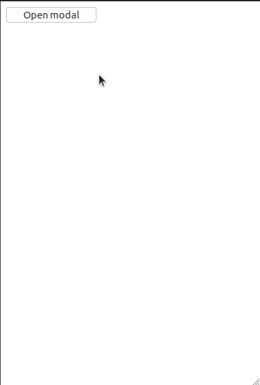
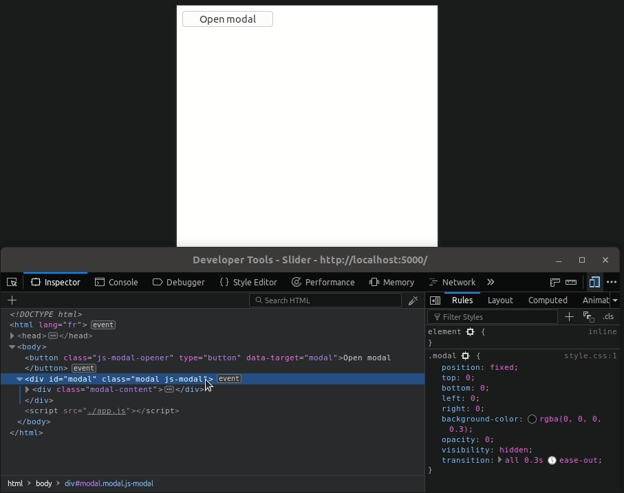

# TD événements / Partie 2

L'objectif de cette seconde partie est de créer un nouveau composant : une
modale. Ce composant permet d'afficher un élément par-dessus la page et empêche
d'intéragir avec elle tant qu'il est ouvert.

Exemple :

## 1ère étape : prendre connaissance du fonctionnement du composant

Le code HTML et CSS est disponible dans `src`. Ceux-ci vous donnent la
structure de base du composant. La modale, dans son état d'origine, est
invisible (propriétés `opacity: 0` et `visibility: hidden` dans le CSS). Et une
classe `modal-open` vient modifier ces règles pour la rendre visible (`opacity:
1` et `visibility: visible`). Lorsqu'on ajoute cette classe à l'élément racine,
la modale apparait :

## 2ème étape : récupération des éléments

Pour pouvoir fonctionner, notre composant a besoin des éléments suivants :

* L'élément racine (portant la classe `js-modal`)
* L'ensemble des éléments ayant pour but d'ouvrir la modale lorsqu'on click dessus (portant la classe `js-modal-opener`, ainsi qu'un attribut `data-target` ayant pour valeur l'ID
de l'élément racine, et pouvant se trouver n'importe où dans le document)
* L'ensemble des éléments ayant pour but de fermer la modale lorsqu'on click dessus (portant la classe `js-modal-closer` et se trouvant à l'intérieur de l'élément racine)

Récupérez ces éléments avec `querySelector` et `querySelectorAll`.

## 3ème étape : initialisation des événements

* Notre modale doit s'ouvrir lorsqu'on clique sur l'un de ses « openers » : le plus simple est d'ajouter un event listener sur chaque opener. Vous pouvez aussi essayer de mettre en place la délégation d'événements
* Elle doit se fermer lorsqu'on clique sur l'un de ses « closers » : même remarque que pour les openers
* Elle doit se fermer lorsqu'on clique sur son élément racine, qui constitue l'ombre, visuellement : attention, n'oubliez pas que les événements remontent l'arbre DOM !
* Elle doit aussi se fermer lorsqu'on appuie sur la touche ECHAP

## 4ème étape : implémentation des méthodes `open` et `close`

Maintenant que tout est en place, il ne nous reste plus qu'à implémenter les
méthodes permettant d'ouvrir et fermer la modale : `open` et `close`. Comme
nous l'avons vu au début, l'ouvertue de la modale revient à l'ajout de la
classe `modal-open` sur son élément racine; et la fermeture revient à supprimer
cette classe. C'est donc le rôle de ces deux méthodes.

## Conclusion

Notre modale est fonctionnelle. Toutefois, ayez en tête que cette implémentation est assez simple et ne prend pas en compte certaines choses :

* Si la modale est plus haut que l'écran, son contenu va déborder et ne va pas être visible
* Si le contenu de la page permet le scroll, alors celui-ci ne sera pas bloqué lorsque la modale est ouverte. Cela peut être étrange du point de vue de l'utilisateur. Il est commun de bloquer le scroll en arrière plan. Plusieurs techniques existent pour ça. Je vous laisse chercher par vous-même

Ce sont des améliorations que vous pouvez essayer d'implémenter par vous-même.
