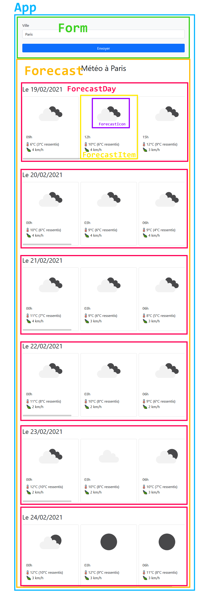

# TD 05 : React

Dans ce TD, nous allons développer une application permettant d'afficher la
météo des jours à venir pour une ville donnée. Pour récupérer les données
météorologiques, nous utiliserons l'API "5 day weather forecast" du service
[Open Weather Map](https://openweathermap.org/).

Voici ce que nous voulons faire : https://wumiz.csb.app/

Lorsque l'utilisateur saisit le nom d'une ville, on envoie une requête
asynchrone à l'API, qui nous renvoie un résultat (des données de prévisions
météorologiques ou une erreur). Pendant qu'on attend le résultat, on affiche un
spinner pour indiquer que le chargement est en cours. Une fois qu'on a reçu le
résultat, si on a des données, on les affiche; si c'est une erreur, on affiche
le message d'erreur.

L'application est développée avec la librairie React et découpée en plusieurs
composants qu'il faut implémenter.

## Mise en place

Téléchargez les sources avec npx, ou initialisez un CodeSandbox en suivant les
indications de https://github.com/drazik/cours-js#cours-javascript.

N'oubliez pas de lancer un `npm install` pour installer les dépendances du
projet.

## Présentation

### Architecture

Voici la manière dont l'application est découpée en composants :



## Implémentation

### Module api

Le module API expose une fonction `fetchForecastForCity`. Cette fonction doit
faire une requête asynchrone (`fetch`, voir cours et TD de la semaine
précédente) vers l'API Open Weather Map.

Pour cela, vous aurez besoin d'une clef d'API. Vous pouvez en créer une en
créant un compte sur [Open Weather
Map](https://home.openweathermap.org/users/sign_up) (garanti sans newsletter
chiante). Une fois votre compte créé, connectez-vous, puis dans le menu cliquez
sur votre identifiant puis dans "My API keys". Sur la nouvelle page qui
s'affiche, sous le titre "Create key", entrez le nom que vous voulez pour votre
nouvelle clef, puis cliquez sur "Generate". La clef sera créée et apparaîtra à
gauche. Vous pouvez la copier et la mettre dans le fichier `.env.example`.
Enfin, renommez le fichier `.env.example` en `.env`.

Le fichier `.env` sert à contenir des variables d'environnement. La clef d'API
est une variable d'environnement parce qu'on pourrait vouloir utiliser une clef
différente pour développer en local et pour la production par exemple.

Une fois votre clef API en place, vous pouvez lancer les tests : 

```
npm run test -- --watchAll api
```

Et suivre les indications pour implémenter le module `src/api.js`.

### Composant Form

Ce composant a pour but de gérer la saisie de l'utilisateur. Le but est de stocker cette saisie dans un state dynamique. Tant que la ville saisie est vide ou composée uniquement d'espaces, le bouton d'envoi du formulaire doit être désactivé. Lorsqu'un nom de ville a été saisi, celui-ci s'active.

Lorsque l'utilisateur envoie le formulaire, le comportement par défaut du
navigateur doit être empêché, et la saisie de l'utilisateur doit être passée à
une fonction `onSubmit` reçue dans les props du composant.

Une suite de tests automatiques vous donnera du feedback sur votre avancement :

```
npm run test -- --watchAll Form
```

### Composant Forecast

Ce composant sert à afficher les données renvoyées par l'API. Il reçoit deux props :

* `city`: un objet de type `{ name: string }` décrivant la ville recherchée
* `forecasts`: un tableau d'objets de la forme suivante : 

```
{
  dt_txt: string, // date de la prévision au format texte
  main: {
    feels_like: number, // température ressentie (en degrés celsius)
    temp: number, // température (en degrés celsius)
  },
  weather: [
   {
     icon: string, // identifiant de l'icône correspondant à la météo
   }
  ],
  wind: {
    speed: number, // vitesse du vent (en km/h)
  }
}
```

Il est découpé en plusieurs composants. Jettez un oeil à la section
architecture ci-dessus pour un aperçu du découpage.

Pour lancer les tests : 

```
npm run test -- --watchAll Forecast
```

### Composant App

Ce composant est le chef d'orchestre. Il s'occupe d'envoyer la requête à l'API
lorsque le formulaire est envoyé, de récupérer le résultat, de l'afficher si on
récupère des données, d'afficher une erreur sinon, et d'afficher un message de
chargement pendant le temps de chargement des données.

Pour cela, il utilise différents states :

* `status`: stocke l'état de la requête asynchrone. Les valeurs possibles sont `"idle"` (en attente), `"loading"` (en cours de chargement), `"success"` (données reçues), `"error"` (erreur reçue). Ce state sert à conditionner l'affichage (message de chargement, données, message d'erreur)
* `data`: stocke les données renvoyées par l'API
* `error`: stocke le message d'erreur produit par l'appel à l'API

Il fait usage de tous les modules développés pour arriver au résultat final.

Pour lancer les tests :

```
npm run test -- --watchAll App
```


## Test dans le navigateur

Pour tester le résultat dans le navigateur, lancez la commande :

```
npm run start
```

Cette commande lance un serveur de développement local avec rafraîchissement
automatique lorsque vous sauvegardez un fichier source. Rendez vous sur
`http://localhost:3000` dans votre navigateur pour y voir le résultat.
