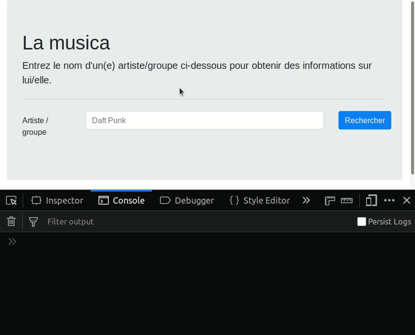

# TP noté

Dans ce TP, nous allons développer une application permettant de récupérer des
données sur des artistes et groupes musicaux. Pour cela, nous allons utiliser
l'API de [Last.fm]().

Un exemple valant mieux que mille mots, vous pouvez vous rendre sur
https://dist-ghgkmexmwl.now.sh/ afin de voir le résultat fonctionnel attendu.

Dans un soucis de ne pas perdre de temps avec des détails qui ne concernent pas
directement le sujet de ce TP, vous n'avez pas besoin de créer un compte sur
l'API Last.fm. Vous recevrez via Slack une liste de 20 clefs API. Prenez celle
qui figure à côté de votre nom.

Cet énoncé découpe le développement de l'application en plusieurs étapes afin
que vous ayez un support vous permettant d'avancer plus facilement. Toutefois,
vous n'êtes pas obligé(e)s de le suivre. Cela signifie qu'une application qui
ne serait pas développée selon la méthode proposée ci-dessous ne sera ni
pénalisée, ni avantagée. Vous pouvez donc : utiliser une approche
fonctionnelle, utiliser un bundler, utiliser un framework / une librairie de
votre choix, etc, ou vous contenter de suivre l'énoncé; cela n'aura pas de
conséquence particulière sur votre note. En revanche, si vous décidez de ne pas
suivre l'énoncé, prenez quand même un instant pour jeter un oeil à la partie «
bonus » qui liste des fonctionnalités qui ne sont pas requises, mais qui
pourront, elles, vous apporter des points bonus si vous réussissez à les
implémenter correctement.

Pour rappel, nous avons déjà fait un travail similaire à deux occasions :

* [Recherche d'un utilisateur via l'API Github](https://codesandbox.io/s/zqq8kykov4)
* [Recherche de la météo pour une ville](https://github.com/drazik/cours-js/tree/master/03/TD/correction)

Vous avez droit à tous les documents. En revanche, la communication via Slack
est interdite.

## 1ère étape : analyse des sources

Vous trouverez les sources dans le dossier [src](src). Pour plus de praticité,
vous pouvez aussi télécharger les sources au format zip : [src.zip](src.zip).

Ces sources contiennent un fichier HTML avec la structure de base de
l'application, et un fichier JS vide. Le fichier HTML importe le framework CSS
[Bootstrap](https://getbootstrap.com/), c'est pourquoi vous voyez des noms de
classes quand bien même il n'y a pas de fichier CSS dans les sources. Vous
n'avez pas besoin de connaître Bootstrap pour avancer, les classes à appliquer
sur chaque élément vous seront données au fur et à mesure.

### Le formulaire

Le formulaire de recherche porte l'`id` `search-form`. Il contient un champ
text portant le `name` `artist` et un bouton de soumission. Quelques classes
issues de Bootstrap sont utilisées sur ces éléments, mais vous n'aurez pas à
les manipuler.

### La zone d'affichage des données

Cet élément porte l'`id` `result-area`. Il est composé de deux sous-éléments
portant les classes `js-result-area-main` et `js-result-area-similar` vouées à
afficher respectivement les données de l'artiste et les données des artistes
similaires. Ces deux sous-éléments sont vides initialement.

## 2ème étape : implémentation du composant `SearchForm`

Commencez par implémenter le composant `SearchForm`. Utilisez la structure de
composants que nous avons vu en cours. Cela signifie que `SearchForm` est une
classe dont le constructeur prend en paramètre un élément du DOM représentant
la racine (« root ») du composant.

Ce composant écoute l'événement `submit` sur le formulaire afin de récupérer la
saisie de l'utilisateur et faire une requête sur l'API Last.fm (via la fonction
`fetch`) afin de récupérer les informations de l'artiste correspondant.

Pour contacter l'API, vous aurez besoin de connaître l'URL de celle-ci. Vous
trouverez cette information sur [la documentation de
l'API](https://www.last.fm/api/show/artist.getInfo).Toutefois, si l'anglais
n'est pas votre fort, voici l'URL (les parties entre accolades sont des
paramètres qu'il vous faudra remplacer) :

```
https://ws.audioscrobbler.com/2.0/?method=artist.getinfo&artist={ARTIST}&api_key={API_KEY}&format=json
```

Commencez par tester cette URL en remplaçant le nom de l'artiste par celui de
votre choix et la clef API par celle que vous avez reçu sur Slack, et en
collant l'URL obtenue dans un nouvel onglet de votre navigateur. Cela vous
donnera la structure des données que l'API renvoie.

Vous avez maintenant tout ce qu'il vous faut pour implémenter le composant
`SearchForm`. Pour cette étape, contentez-vous d'afficher les données que l'API
renvoie dans la console du navigateur (grâce à `console.log`).

À la fin de cette étape, vous devriez avoir un résultat qui ressemble à ceci :



## 3ème étape : implémentation du composant `ResultArea`

Le composant `ResultArea` va lui s'occuper d'afficher les données reçues.
Celui-ci va fournir 3 méthodes lui permettant de réagir aux 3 états possibles
d'une requête : chargement, données reçues, erreur reçue. Nommez ces méthodes
comme bon vous semble, nous les appelerons `showLoading`, `showData` et
`showError` dans la suite.

Pour le moment, faites en sortes que `showLoading` affiche `Loading...` dans la
console; que `showData` affiche les données qu'elles reçoit en paramètre dans
la console; et que `showError` affiche l'erreur qu'elle reçoit en paramètre
dans la console.

Il faut maintenant « brancher » ce composant à `SearchForm`, afin de mettre à
jour l'affichage selon l'état de la requête lancée par celui-ci. Pour
commencer, faites en sorte que le constructeur de `SearchForm` prenne en
deuxième paramètre une instance de `ResultArea`. Puis servez-vous de cette
instance pour remplacer les `console.log` qui servent actuellement à afficher
les données en console dans `SearchForm`. Testez que les données s'affichent
toujours bien dans la console.

Il reste maintenant à implémenter l'affichage à proprement parler. Comme
`SearchForm`, `ResultArea` a besoin d'un élément du DOM « racine » pour
fonctionner. Celui-ci est désigné dans le HTML par l'id `result-area`.
Passez-donc cet élément du DOM en premier paramètre du constructeur de
`ResultArea`.

L'affichage des données est divisé en deux parties :

* Celle concernant l'artiste recherché
* Celle listant les artistes similaires à l'artiste recherché

### Afficher les données de l'artiste recherché

Ces données vont être affichées dans l'élément qui a la classe
`js-result-area-main`. Récupérez-donc cet élément à l'aide de la méthode
`querySelector` appliquée à l'élément racine de `ResultArea`. Une fois ceci fait, implémentez une fonction `showMainData` prenant en paramètre les données reçues via l'API, et créant la structure DOM suivante :

```html
<div class="media">
  
  <div class="media-body">
    <h2 class="mt-0">{NOM DE L'ARTISTE}</h2>
    <div class="mt-2 mb-2">
      <a href="{URL TAG 1}" class="badge badge-pill badge-info">{TAG 1}</a>
      <a href="{URL TAG 2}" class="badge badge-pill badge-info">{TAG 2}</a>
      <a href="{URL TAG 3}" class="badge badge-pill badge-info">{TAG 3}</a>
      <a href="{URL TAG 4}" class="badge badge-pill badge-info">{TAG 4}</a>
      <a href="{URL TAG 5}" class="badge badge-pill badge-info">{TAG 5}</a>
    </div>
    <p class="mt-4">
      {RÉSUMÉ DE LA BIO DE L'ARTISTE}
    </p>
  </div>
</div>
```

En remplaçant chaque donnée entre accolades par les données issues de l'API. Appelez la méthode `showMainData` dans la méthode `showData`.

Pour créer cette structure, utilisez `document.createElement`, `element.append(otherElement)`, etc.

Idéalement pour l'image de l'artiste, affichez l'image correspondant à la
`size` `mega`. Mais ne perdez pas de temps là-dessus. Prenez simplement la
première image du tableau si besoin.

### Afficher les artistes similaires

Ces données vont être affichées dans l'élément qui a la classe `js-result-area-similar`. Récupérez donc cet élément à l'aide de la méthode `querySelector` appliquée à l'élément racine de `ResultArea`. Une fois ceci fait, implémentez une fonction `showSimilarData` prenant en paramètre les données reçues via l'API, et créant la structure DOM suivante pour chaque artiste similaire :

```html
<div class="col-sm">
  <div class="card">
    
    <div class="card-body">
      <h5 class="card-title">{NOM DE L'ARTISTE SIMILAIRE}</h5>
      <a href="{URL DE L'ARTISTE SIMILAIRE}" class="btn btn-primary">Voir sur Last.fm</a>
    </div>
  </div>
</div>
```

En remplaçant chaque donnée entre accolades par les données issues de l'API. Appelez la méthode `showSimilarData` dans la méthode `showData`.

Pour créer cette structure, utilisez `document.createElement`, `element.append(otherElement)`, etc.

Une fois ceci terminé, vous devriez avoir un résultat très proche de https://dist-ghgkmexmwl.now.sh/. Vous
pouvez vous arrêter là, faire un zip de vos sources et l'envoyer sur Slack ou
par mail. Vous pouvez aussi tenter d'implémenter les bonus ci-dessous.

## Bonus

### Afficher un spinner et désactiver le bouton de soumission lors du chargement

Dans le composant `SearchForm`, il est possible de montrer que les données sont
en cours de chargement en modifiant le contenu du bouton de soumission du
formulaire, et en le désactivant, afin que l'utilisateur ne puisse pas cliquer
dessus pendant le chargement.

Pour cela, pendant le chargement, modifiez le contenu du bouton pour qu'il affiche le HTML suivant :

```html
<span class="spinner-border spinner-border-sm"></span>
```

Puis restorez l'affichage « normal » du bouton lorsque les données sont chargées.

### Mettre en cache les réponses de l'API

Créez un objet de cache faisant la correspondance entre un nom d'artiste et les
données que l'API a déjà renvoyé pour celui-ci.

Par exemple, ce cache pourrait ressembler à ceci après que l'utilisateur ait recherché « Pink Floyd » et « Supertramp » : 

```js
{
  "pink floyd": { /* données de l'API */ },
  "supertramp": { /* données de l'API */ }
}
```

Puis utilisez ce cache pour ne pas lancer de requête vers l'API si les données
pour l'artiste demandé y figurent déjà. De cette manière, l'affichage des
données d'artistes déjà recherchés s'afficheront instantanément.
