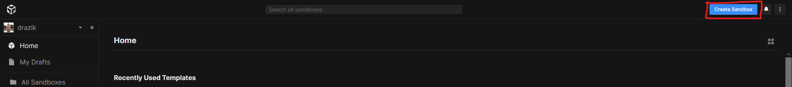
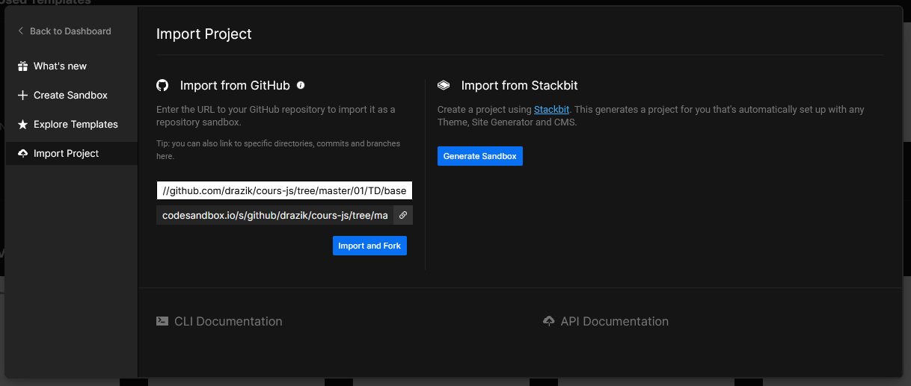
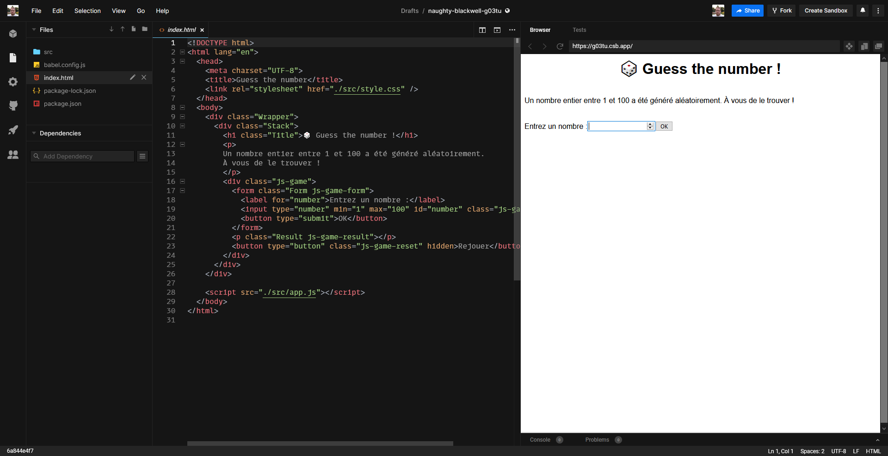
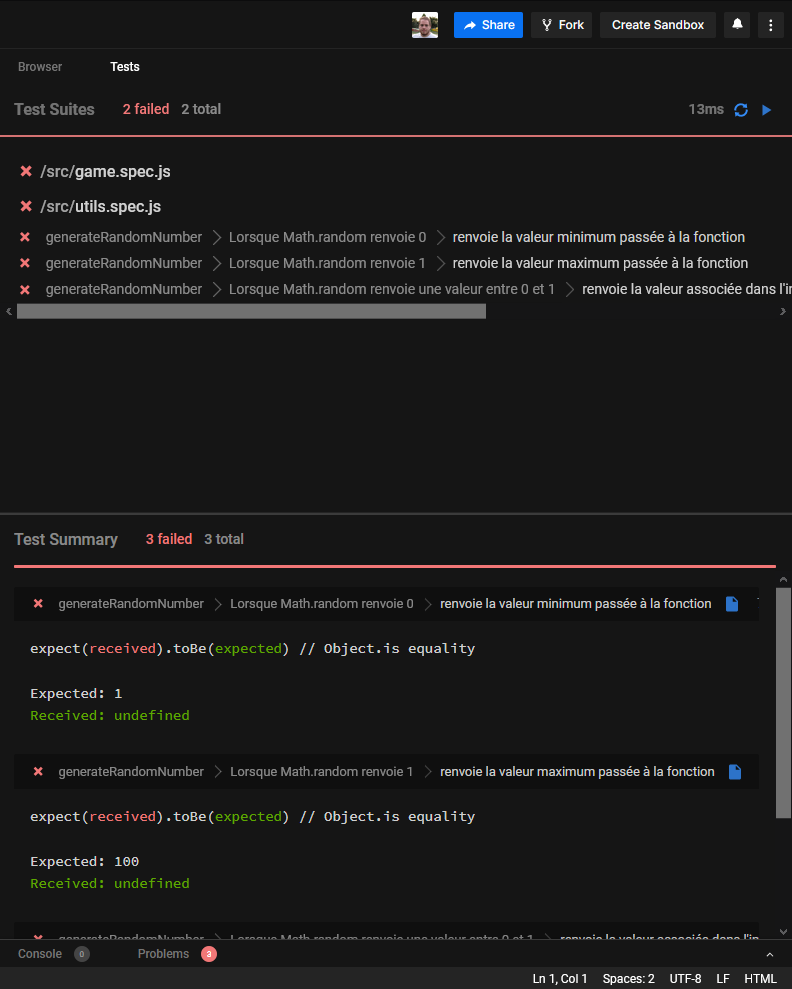

# Cours JavaScript

## TD

### En local

#### NodeJS / npm

Pour travailler en local, tous les TD nécessitent l'installation de NodeJS et
npm. Pour installer NodeJS et npm, rendez vous sur https://nodejs.org/en/ pour
télécharger l'installateur qui correspond à votre système.

Une fois installé, vous devez avoir accès aux commandes `node`, `npm` et `npx`.
Pour tester ça, lancez les commandes suivantes :

```console
node -v
npm -v
npx -v
```

Ces commandes doivent vous renvoyer des numéros de version, pas d'erreur.

#### Récupérer les sources de base ou la correction d'un TD

Chaque TD est divisé en deux dossiers : `base` et `correction`. Pour récupérer
les sources de base ou la correction d'un TD, vous pouvez utiliser
[degit](https://github.com/Rich-Harris/degit). Par exemple pour récupérer les
sources de base du premier TD :

```console
npx degit drazik/cours-js/01/TD/base td-01
```

`td-01` est le nom du dossier qui sera créé sur votre machine, donc vous pouvez
le remplacer par le nom de votre choix.

Une fois les sources récupérées, vous pouvez ouvrir le dossier dans votre
éditeur de code favori. Et vous pouvez lancer les tests avec la commande `npm
run test`. Des commandes plus précises peuvent être données dans l'énoncé de
chaque TD.

Pour lancer le serveur local afin de voir le projet dans votre navigateur, vous
pouvez lancer la commande `npm run start`. Cela lancera un serveur sur l'URL
`http://localhost:1234`.

### Sur CodeSandbox

Tous les TD peuvent être importés sur [CodeSandbox](https://codesandbox.io/).
De cette manière, vous n'avez pas besoin d'installer quoi que ce soit en local.
C'est particulièrement pratique sur les machines sur lesquelles vous ne pouvez
pas intaller NodeJS, ou pour avoir accès à vos TD à partir de n'importe quelle
machine.

Pour cela, créez un compte sur CodeSandbox, puis cliquez sur le bouton "Create
Sandbox" en haut à droite de la fenêtre :



Dans l'encart qui s'ouvre, cliquez sur "Import Project", puis collez l'URL du
dossier à importer. Par exemple, pour importer les sources de base du premier
TD, collez l'URL `https://github.com/drazik/cours-js/tree/master/01/TD/base`.



CodeSandbox va importer les sources à partir de l'URL spécifiée, puis vous
rediriger dans l'interface d'édition.



Dans cette interface, vous pouvez lancer les tests en allant dans l'onglet "Tests" de l'encart de droite.


