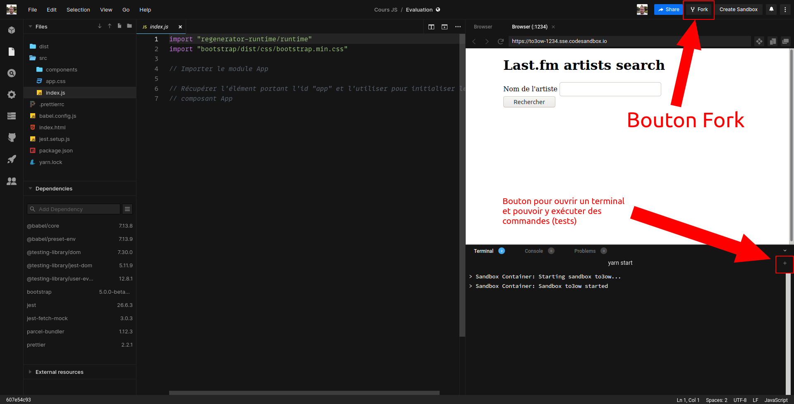

# Evaluation

Lors de cette évaluation, vous allez développer une application client
permettant à un utilisateur de trouver des informations à propos d'un artiste
musical dans la base de données [Last.fm](https://www.last.fm).

Le résultat final souhaité est celui présenté sur
https://8pd69-1234.sse.codesandbox.io/

L'épreuve dure 3h : de 8h30 à 11h30.

## Mise en place de l'environnement

### Environnement local

Cette méthode est à utiliser si vous avez NodeJS installé sur votre machine.

Sur un environnement local, vous pouvez utiliser degit :

```
npx degit drazik/cours-js/evaluation/base evaluation
```

Ou dézipper le ZIP qui vous sera envoyé sur Discord dans le dossier de votre
choix.

Puis exécutez la commande `npm install`.

### Sur CodeSandbox

Si vous n'avez pas la possibilité d'installer NodeJS sur votre machine, vous
pouvez passer par CodeSandbox. Pour cela, rendez-vous sur
https://codesandbox.io/s/evaluation-to3ow?file=/src/index.js puis cliquez sur
le bouton "Fork" en haut à droite de la fenêtre. Cela va copier le projet dans
votre compte CodeSandbox. 

Dans cet environnement de développement, vous avez accès aux fichiers sources,
une fenêtre de navigateur et un terminal dans lequel vous pourrez taper les
commandes listées dans la suite de l'énoncé.



## Développement

L'application est découpée en 4 composants, situés dans le dossier `src/components` :

* `Artist`: ce composant expose une fonction `make` prenant en paramètre un objet décrivant un artiste, crée la structure d'éléments DOM permettant d'afficher ces données dans la page, et la retourne
* `Result`: ce composant expose une fonction `init`, qui lorsqu'elle est appelée renvoie un objet exposant 3 fonctions `showLoading`, `showError`, `showArtist` permettant respectivement d'afficher un message de chargement, un message d'erreur et les données d'un artiste
* `SearchForm`: ce composant expose une fonction `init`, qui lorsqu'elle est appelée doit initialiser divers événements afin de gérer l'état du formulaire et faire une requête asynchrone lorsque celui-ci est envoyé
* `App`: ce composant expose une fonction `init` qui initiale un composant `Result` et un composant `SearchForm`, et les fait communiquer entre eux

Votre objectif est d'implémenter ces 4 composants. Chaque composant possède sa
propre suite de tests automatisés pour vous guider dans l'implémentation.

### Composant Artist

Ce composant expose une fonction `make` qui reçoit en paramètre un objet de la
forme suivante :

```
{
  name: "Daft Punk",
  tags: [
    { name: "electronic", url: "https://www.last.fm/tags/electronic" },
    { name: "dance", url: "https://www.last.fm/tags/dance" },
    { name: "House", url: "https://www.last.fm/tags/House" },
    { name: "electronica", url: "https://www.last.fm/tags/electronica" },
    { name: "techno", url: "https://www.last.fm/tags/techno" },
  ],
  bio: {
    summary: "longue chaîne de caractères tronquée pour l'exemple",
  },
  similar: ["Justice", "Stardust", "Thomas Bangalter", "Modjo", "Cassius"],
}
```

Le but de cette fonction est de créer la structure d'éléments suivante :

```html
<article>
  <h1>Daft Punk</h1>
  <ul class="list-unstyled d-flex gap-1">
    <li aria-label="electronic">
      <a
        href="https://www.last.fm/tag/electronic"
        class="badge bg-primary text-decoration-none text-white"
      >
        electronic
      </a>
    </li>
    <li aria-label="dance">
      <a
        href="https://www.last.fm/tag/dance"
        class="badge bg-primary text-decoration-none text-white"
      >
        dance
      </a>
    </li>
    <li aria-label="House">
      <a
        href="https://www.last.fm/tag/House"
        class="badge bg-primary text-decoration-none text-white"
      >
        House
      </a>
    </li>
    <li aria-label="electronica">
      <a
        href="https://www.last.fm/tag/electronica"
        class="badge bg-primary text-decoration-none text-white"
      >
        electronica
      </a>
    </li>
    <li aria-label="techno">
      <a
        href="https://www.last.fm/tag/techno"
        class="badge bg-primary text-decoration-none text-white"
      >
        techno
      </a>
    </li>
  </ul>
  <p>Biograpahie de l'artiste... (tronqué pour l'exemple)</p>
  <h2>Artistes similaires</h2>
  <ul>
    <li aria-label="Justice">Justice</li>
    <li aria-label="Stardust">Stardust</li>
    <li aria-label="Thomas Bangalter">Thomas Bangalter</li>
    <li aria-label="Modjo">Modjo</li>
    <li aria-label="Cassius">Cassius</li>
  </ul>
</article>
```

Les attributs `aria-label` doivent être appliqués aux élément en utilisant la
méthode `setAttribute("aria-label", "label à appliquer")`.

Pour lancer les tests de ce composant, lancez la commande `npm run test -- --watchAll Artist.spec.js`.

### Composant Result

Ce composant expose une fonction `init` qui prend en paramètre un élément du
DOM. Son objectif est de définir 3 fonctions permettant d'afficher des choses
dans cet élément :

* `showLoading`: affiche le message "Chargement en cours..."
* `showError`: affiche le message d'erreur reçu en paramètre
* `showArtist`: affiche les données de l'artiste reçu en paramètre (utiliser la fonction `make` du composant `Artist` que vous venez de développer)

Pour lancer les tests de ce composant, lancez la commande `npm run test -- --watchAll Result.spec.js`.

### Composant SearchForm

Ce composant expose une fonction `init` qui prend en paramètre un élément du
DOM et un objet contenant 3 propriétés `onLoading`, `onError` et `onSuccess`.
Le but de cet objet est de permettre d'interfacer le composant SearchForm avec
un autre composant en "branchant" sur `onLoading`, `onError` et `onSuccess` des
fonctions qui seront exécutées lorsque le formulaire passera en mode
chargement, qu'il aura reçu une réponse de succès ou une réponse d'erreur.

Ce composant s'utilisera de la façon suivante :

```js
SearchForm.init(element, {
  onLoading: () => console.log("loading..."),
  onError: (errorMessage) => console.log("Erreur : ", errorMessage),
  onSuccess: (artist) => console.log("Artiste reçu : ", artist),
})
```

Le but ici est principalement d'écouter l'événement "submit" sur le formulaire
afin d'envoyer une requête asynchrone lorsque celui-ci est déclenché. La
requête doit être envoyée sur l'URL suivante :

```
https://lastfm-proxy-evaluation.herokuapp.com/artist?q=nom_de_l'artiste_saisi
```

Après avoir formé l'URL finale à partir de la partie statique
(https://lastfm-proxy-evaluation.herokuapp.com/artist?q=) et du nom de
l'artiste saisi par l'utilisateur, il faut donc envoyer une requête asynchrone
avec la méthode GET sur cette URL.

Le serveur peut répondre :

* Avec succès, auquel cas le corps de la réponse contient les données de l'artiste au format JSON. Dans ce cas, il faut appeler la fonction `onSuccess` en lui passant en paramètre l'objet des données de l'artiste
* Avec une erreur 404, auquel cas le corps de la réponse est vide. Dans ce cas, il faut appeler la fonction `onError` en lui passant en paramètre le message `Artiste introuvable`
* Une autre erreur. Dans ce cas, il faut appeler la fonction `onError` en lui passant en paramètre le message `Erreur inconnue`

Le composant gère aussi l'état du bouton d'envoi du formulaire. Si le champ de
saisie est vide ou contient uniquement des espaces, ce bouton doit être
désactivé.

Pour lancer les tests de ce composant, lancez la commande `npm run test -- --watchAll SearchForm.spec.js`.

### Composant App

Ce composant expose une fonction `init`. Cette fonction prend en paramètre un
élément du DOM. Le but de cette fonction est d'initialiser un composant
`Result` et un composant `SearchForm` et de les faire communiquer l'un avec
l'autre (via les fonctions retournées par le composant `Result` et les options
acceptées en paramètres par le composant `SearchForm`).

Pour lancer les tests de ce composant, lancez la commande `npm run test -- --watchAll App.spec.js`.

### Fichiers `index.html` et `src/index.js`

Une fois les composants développés et que les tests automatisés passent tous,
il faudra utiliser tout ce code dans la page `index.html`. Pour ça, il faudra y include le script `src/index.js`.

Dans `src/index.js`, il faudra importer le composant `App` et l'initialiser en
lui passant le bon élément du DOM.

Une fois ce travail effectué, votre application doit être fonctionnelle. Vous
pouvez lancer la commande `npm run start` et tester votre application dans
votre navigateur. Si vous utilisez CodeSandbox, alors cette commande est lancée
automatiquement.

## Envoi de votre travail

Si vous avez travaillé sur votre machine, alors faites un ZIP de vos fichiers
sources (n'incluez pas les dossiers `node_modules`, `dist`, et `.cache` dans
l'archive). Envoyez le ZIP en message privé sur Discord ou par mail.


Si vous avez travaillé sur CodeSandbox, alors envoyez l'URL de votre
CodeSandbox en message privé sur Discord ou par mail.
