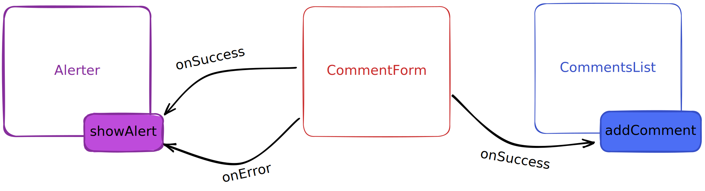

# Exercice : liste de commentaires

L'objectif est de développer la page d'un article de blog. Sur cette page, un article est présenté de manière statique. On souhaite aussi afficher une liste de commentaires. Ces commentaires sont chargés de manière asynchrone au changement de la page. Un formulaire doit permettre d'ajouter un nouveau commentaire de manière asynchrone. Enfin, lorsqu'un commentaire a bien été ajouté ou qu'une erreur est survenue, un message de succès ou d'erreur doit s'afficher.

Pour initialiser l'exercice :

```console
npx degit drazik/cours-js/exercices/comments-list comments-list
cd comments-list
npm install
```

Pour lancer le serveur de développement :

```console
npm run dev
```

## Etape 1 : prise de connaissance du code initial

Le fichier `index.html` contient la structure initiale de la page. On y retrouve les éléments constituant l'article de blog (titre, date, contenu); un élément vide destiné à contenir les commentaires récupérés auprès du serveur de manière asynchrone; et un formulaire permettant d'ajouter un nouveau commentaire. Ce fichier charge le fichier `style.css` ainsi que le fichier `main.js`.

Le fichier `style.css` contient les styles de la page. Vous n'avez pas besoin d'y toucher, mais vous pouvez tout de même y jeter un oeil afin de comprendre comment la page est faite.

Le fichier `main.js` est vide. Vous allez devoir y instancier les différents composants et les faire communiquer les uns avec les autres pour arriver au résultat final.

Vous trouverez aussi les fichiers des différents composants (cf ci-après) :

- `alerter.js` et `alerter.css`: fichiers du composant Alerter
- `comment-form.js` : fichier du composant CommentForm
- `comments-list.js` : fichier du composant CommentsList

## Etape 2 : description des composants

Pour arriver à son fonctionnement final, le comportement de l'application est découpé en plusieurs composants qui s'occuperont chacun d'une partie du fonctionnement. L'objectif de ce découpage est que le code final soit plus facilement maintenable et testable. Notamment parce que chaque composant aura un rôle bien précis et proposera une interface (API) permettant de le connecter aux autres.

### Le composant `CommentsList`

Ce composant s'occupe de récupérer les commentaires initiaux auprès du serveur et de les afficher dans l'élément dédié à cet effet. Il expose aussi une fonction permettant d'afficher un nouveau commentaire.

### Le composant `CommentForm`

Ce composant s'occupe de gérer la saisie d'un nouveau commentaire dans le formulaire. Lorsque l'utilisateur envoie le formulaire, il envoie une requête asynchrone au serveur et récupère la réponse. Il prend en paramètre des options qui permettent à l'utilisateur du composant de spécifier le comportement à adopter en cas de succès et en cas d'erreur. Ainsi, le composant ne s'occupe pas de l'affichage des nouveaux commentaires. Ce sera le rôle du composant `CommentsList`.

### Le composant `Alerter`

Le rôle de ce composant est de gérer les alertes. C'est à dire les messages importants affichés à l'utilisateur. Ces messages peuvent être de deux types : succès ou erreur. Les messages s'affichent en bas à gauche de l'écran. Plusieurs messages peuvent être affichés en même temps. Et les messages peuvent disparaître automatiquement après un délai, ou être fermés en cliquant sur un bouton.

### Communication entre les composants

Le composant `CommentForm` prendra en paramètre deux fonctions : `onSuccess` et `onError`. La première sera appelée lorsqu'un nouveau commentaire a bien été créé par le serveur; la deuxième en cas d'erreur lors de la création d'un commentaire.

Le composant `CommentsList` exposera une fonction `addComment`. Cette fonction prendra en paramètre un objet représentant un commentaire à afficher dans la liste. On pourra donc passer cette fonction en paramètre `onSuccess` du `CommentForm`. De cette manière, lorsqu'un commentaire aura été créé par le serveur, il sera affiché dans la liste.

Le composant `Alerter` exposera une fonction `showAlert` qui prendra deux paramètres :

- le message d'alerte à afficher
- un objet d'options avec les propriétés suivantes :
  - `type` (requis) : soit `"success"` soit `"error"`. Cette option permettra d'appliquer les bons styles à l'élément pour refléter visuellement son type (vert pour le succès, rouge pour l'erreur)
  - `autoCloseDelay` (optionnel) : un nombre de millisecondes au bout duquel le message doit automatiquement disparaître

Ainsi, on pourra passer à la fonction `onSuccess` du `CommentForm` un appel à `showAlert(message, { type: "success" })`; et à la fonction `onError` du `CommentForm` un appel à `showAlert(message, { type: "error" })`.

L'architecture est résumée dans le diagramme suivant :



## Etape 3 : implémentation du composant `CommentsList` (première partie)

En premier lieu, commençons l'implémentation du composant `CommentsList`. Ce composant doit récupérer auprès du serveur les commentaires initiaux et les afficher.

Pour récupérer les données des commentaires initiaux, il faut faire une requête asynchrone sur l'URL `http://localhost:5173/comments`. Le serveur renvoie un tableau d'objets avec la forme suivante :

```ts
type Comment = {
  id: string
  publishedAt: string
  email: string
  content: string
}
```

Pendant le chargement des données, le message "Chargement des commentaires en cours" doit être affiché. Si une erreur survient pendant le chargement des données, le message "Erreur lors du chargement des commentaires" doit être affiché. Enfin, si tout s'est bien passé, il faut afficher les commentaires dans la page.

Pour cela, il faudra créer dynamiquement, pour chaque commentaire, la structure HTML suivante :

```html
<article class="comment">
  <p class="comment__email">comment.email</p>
  <time datetime="comment.publishedAt" class="comment__date">
    new Date(comment.publishedAt).toLocaleDateString()
  </time>
  <p class="comment__content">comment.content</p>
</article>
```

Puis insérer tous les éléments créés dans l'élément racine du composant `CommentsList`.

Pour tester votre implémentation, il faudra instancier le composant dans le fichier `main.js`. Pour cela :

```js
// Importer le composant
import * as CommentsList from "./comments-list"

// Récupérer l'élément racine du composant
const commentsListRoot = document.querySelector(
  "[data-component='comments-list']"
)

// Vérification que l'élément racine a été trouvé
if (commentsListRoot === null) {
  throw new Error("Couldn't find comments list root")
}

// Instanciation du composant
const commentsList = CommentsList.init(commentsListRoot)
```

## Etape 4 : implémentation du composant `CommentsList` (deuxième partie)

Le composant `CommentsList` doit exposer une fonction `addComment` qui, lorsqu'on l'appelle en lui passant en paramètre un commentaire, doit l'afficher à la suite de ceux déjà affichés.

Il faut donc créer cette fonction et faire en sorte que le compoosant `CommentsList` la retourne, afin que l'utilisateur du compoosant puisse récupérer cette fonction et l'appeler là où il en a besoin.

Pour tester la fonction, vous pouvez exposer l'instance du composant dans une variable globale :

```js
// Fichier main.js

window.__commentsList__ = commentsList
```

Puis appeler la fonction `addComment` dans la console du navigateur :

```js
window.__commentsList__.addComment({
  id: "abcdef-1234",
  email: "john@doe.com",
  publishedAt: "2022-12-15",
  content: "Lorem ipsum dolor sit amet consectetur adipiscing",
})
```

Le nouveau commentaire doit apparaître à la suite des autres dans la page.

La structure d'un commentaire est toujours la même qu'à l'étape précédente. Pensez à mutualiser le code !

## Etape 5 : implémentation du composant `CommentForm`

Le rôle de ce composant est de gérer la saisie de l'utilisateur et d'envoyer au serveur les données saisies pour que celui-ci crée le nouveau commentaire.

Ce composant prend deux paramètres :

- l'élément racine (un formulaire)
- un objet d'options contenant :
  - une propriété `onSuccess` : une fonction qui sera appelée lorsqu'un commentaire a bien été créé par le serveur. Elle recevra en paramètre le commentaire créé
  - une propriété `onError` : une fonction qui sera appelée lorsqu'une erreur est survenue à la création d'un commentaire par le serveur. Elle recevra en paramètre l'erreur levée

On utilisera donc le composant de cette manière :

```js
import * as CommentForm from "./comment-form"

const commentFormRoot = document.querySelector(
  "[data-component='comment-form']"
)

if (commentFormRoot === null) {
  throw new Error("Couldn't find comment form root")
}

const commentForm = CommentForm.init(commentFormRoot, {
  onSuccess: (newComment) => console.log(newComment),
  onError: (error) => console.log(error),
})
```

Dans cet exemple, le commentaire créé ainsi que l'eventuelle erreur levée à la création du commentaire sont affichés dans la console.

L'utilisateur a à sa disposition deux champs de formulaire : e-mail et contenu du commentaire. Lorsqu'il saisit des données et les envoie au serveur, alors plusieurs cas peuvent se produire :

- Les deux champs sont bien remplis : le serveur renvoie une réponse de succès (status `201`) et la réponse contient l'objet représentant le commentaire créé
- Au moins un champ n'a pas été remplit : le serveur renvoie une réponse d'erreur (status `400`) et la réponse contient un objet qui décrit l'erreur. Par exemple: `{ message: "Le champ e-mail est requis" }`

Notre objectif est donc d'envoyer les données saisies par l'utilisateur au serveur sur l'URL `http://localhost:5173/comment` avec la méthode `post`, de récupérer la réponse du serveur, vérifier si celle-ci est un succès ou une erreur, et agir en conséquence.

Lorsque la réponse du serveur est un succès, on veut récupérer les données qu'elle contient et appeler l'option `onSuccess` en lui passant l'objet récupéré en paramètre. Et lorsque la réponse du serveur est une erreur, si le status de la réponse est `400`, on veut récupérer les données de la réponse pour récupérer le message d'erreur renvoyé par le serveur, et appeler l'option `onError` en lui passant en paramètre ce message. Si le status de la réponse n'est pas 400, on veut appeler l'option `onError` en lui passant en paramètre la chaîne `"Une erreur inconnue est survenue"`.

En dernier lieu, il faudra "brancher" le composant `CommentForm` et le composant `CommentsList` afin que lorsqu'un commentaire a bien été créé, alors celui-ci s'affiche dans la page. Rappelez-vous que `CommentForm` prend l'option `onSuccess`, et que le composant `CommentsList` expose une fonction `addComment`.

## Etape 6 : implémentation du composant `Alerter` (première partie)

Le rôle de ce composant est d'afficher des messages d'alertes. Ces messages peuvent être de deux types : succès ou erreur. Le composant doit s'utiliser de la manière suivante :

```js
import * as Alerter from "./alerter"

const alerterRoot = document.querySelector("[data-component='alerter']")

if (alerterRoot === null) {
  throw new Error("Couldn't find alerter root")
}

const alerter = Alerter.init(alerterRoot)

// Affichage d'un message de succès
alerter.showAlert("Message de succès !", { type: "success" })

// Affichage d'un message d'erreur
alerter.showAlert("Message d'erreur :(", { type: "error" })
```

L'objectif de la fonction `showAlert` est donc d'afficher un message dans l'élément racine du composant Alerter. Pour cela, la structure d'un message d'alerte doit être la suivante :

```html
<div class="alert alert--{type}">
  <p class="alert__message">{message}</p>
  <button type="button" class="alert__close">
    <svg
      xmlns="http://www.w3.org/2000/svg"
      fill="none"
      viewBox="0 0 24 24"
      stroke-width="1.5"
      stroke="currentColor"
      width="22"
      height="22"
    >
      <path
        stroke-linecap="round"
        stroke-linejoin="round"
        d="M6 18L18 6M6 6l12 12"
      />
    </svg>
  </button>
</div>
```

Lorsque l'utilisateur click sur le bouton contenant l'icône de croix, le message doit disparaître de l'écran.

Ce composant doit être utilisé pour afficher un message de succès lorsqu'un commentaire a bien été créé; et un message d'erreur lorsqu'une erreur est survenue lors de la création d'un commentaire. Pensez à utiliser les options `onSuccess` et `onError` du composant `CommentForm` pour ça.

## Etape 7 : implémentation du composant `Alerter` (deuxième partie)

Dans le paramètre d'options de la fonction `showAlert`, l'utilisateur du composant doit avoir la possibilité de passer la propriété `autoCloseDelay` avec un nombre. Ce nombre est un nombre de millisecondes au bout duquel le message d'alerte doit disparaître automatiquement.

Pour implémenter ce comportement, utilisez la fonction [`setTimeout`](https://developer.mozilla.org/fr/docs/Web/API/setTimeout).

Une fois ce comportement implémenté, vous pouvez ajouter la propriété `autoCloseDelay` aux appels à la fonction `showAlert` que vous faites, afin que les messages disparaissent automatiquement au bout de 7 secondes.

## Conclusion

Vous disposez maintenant d'une page complète. Chaque fonctionnalité est proprement découplée des autres. Ainsi, chaque composant peut être réutilisé dans un autre contexte. Les composants `CommentsList` et `CommentForm` sont fortement liés au concept de commentaire, bien sur. Mais le composant `Alerter` peut être utilisé pour afficher des messages d'alerte dans n'importe quel autre contexte.

De plus, ces composants sont testables en isolation (sans avoir à prendre en compte les autres composants). Ils sont donc plus facilement maintenables et évolutifs que si tout était mélangé dans un seul composant.
