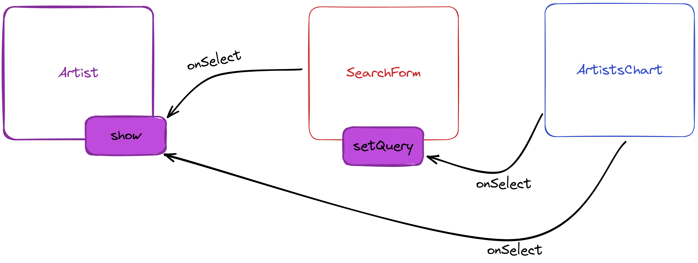

# Exercice JS : music charts

L'objectif est de développer une application qui s'appuie sur l'API de [Last.fm](https://www.last.fm/api) pour récupérer le top des artistes les plus écoutés. Au click sur le nom d'un des artistes, l'application utillisera à nouveau l'API pour récupérer les infos détaillées de cet artiste. Enfin, l'application proposera un formulaire de recherche avec de l'autocomplétion. Lorsque le nom d'un artiste sera sélectionné dans ce champ de recherche, les détails de cet artiste seront affichés.

## Récupération du code initial

```console
npx degit drazik/cours-js/exercices/music-charts music-charts
cd music-charts
npm install
```

Pour lancer le serveur de développement :

```console
npm run dev
```

Le serveur de développement est accessible sur http://localhost:5173.

## Création d'une clé API sur Last.fm

L'API Last.fm requiert d'envoyer en paramètre une chaîne de caractères permettant d'identifier l'utilisateur faisant les appels à l'API. On appelle cette chaîne de caractères une clé d'API (API key en anglais). Nous allons donc devoir demander à Last.fm de nous générer une clé d'API.

Pour cela, créez un compte utilisateur sur Last.fm via [le formulaire de création de compte](https://www.last.fm/join?next=/api/account/create). Une fois votre compté créé, rendez vous sur [le formulaire permettant de créer une clé API](https://www.last.fm/api/account/create). Remplissez le champ "Application name" avec le nom de votre choix (par exemple "Exercice JS") puis envoyez le formulaire. Sur la page suivante, 2 informations vous sont affichées : API Key et Shared secret.

Seule l'API Key nous intéresse ici. Copiez la clé affichée et collez-la dans le fichier `api.js` en valeur de la variable `API_KEY`.

## Architecture



## Module ArtistsChart

Prend en paramètre une fonction `onSelect` qui prend en paramètre un objet représentant l'artiste sélectionné. Cet objet a (entre autres) une propriété `name` représentant le nom de l'artiste.

Le module utilise le endpoint [`chart.gettopartists`](https://www.last.fm/api/show/chart.getTopArtists) de l'API Last.fm pour récupérer les données des artistes les plus écoutés.

Les artistes sont affichés sous forme de boutons. Lorsqu'on click sur un des boutons, la fonction `onSelect` reçue dans l'objet d'options doit être appelée avec l'artiste sélectionné en paramètre.

## Module Artist

Expose une fonction `show` qui prend en paramètre le nom d'un artiste.

Le module utilise le endpoint [`artist.getinfo`](https://www.last.fm/api/show/artist.getInfo) de l'API Last.fm pour récupérer les informations de l'artiste à partir de son nom. Ces données sont utilisées pour afficher le détail d'un artiste. La structure HTML à afficher est la suivante :

```html
<article>
	<h2>Nom de l'artiste</h2>
	<ul>
		<li>Tag 1</li>
		<li>Tag 2</li>
		<!-- autres tags -->
	</ul>
	<p>Bio résumée de l'artiste</p>
	<h3>Artistes similaires</h3>
	<ul>
		<li>Artiste similaire 1</li>
		<li>Artiste similaire 2</li>
		<!-- autres artistes similaires -->
	</ul>
</article>
```

## Module SearchForm

Prend en paramètre une fonction `onSelect` qui prend en paramètre un objet représentant l'artiste sélectionné. Cet objet a (entre autre) une propriété `name` représentant le nom de l'artiste.

Lorsque l'utilisateur commence à taper le nom d'un artiste, une requête doit être envoyée au endpoint [`artist.search`](https://www.last.fm/api/show/artist.search) de l'API Last.fm à chaque caractère tapé. Le résultat de la requête doit être utilisé pour afficher des suggestions en alimentant le contenu de l'élément `<datalist>` avec des éléments `<option>` :

```html
<option value="Nom de l'artiste">Nom de l'artiste</option>
```

Lorsqu'une option est sélectionnée par l'utilisateur, la fonction `onSelect` reçue dans l'objet d'options doit être appelée avec le nom de l'artiste sélectionné passé en paramètre.

Le module doit aussi exposer une fonction `setQuery` prenant en paramètre une chaîne de caractère. Lorsque la fonction est appelée, la chaîne de caractère reçue en paramètre est assignée en valeur du champ de recherche.
